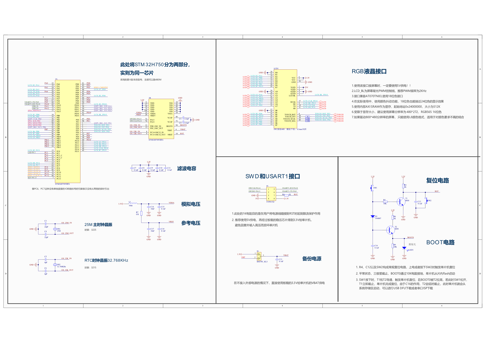
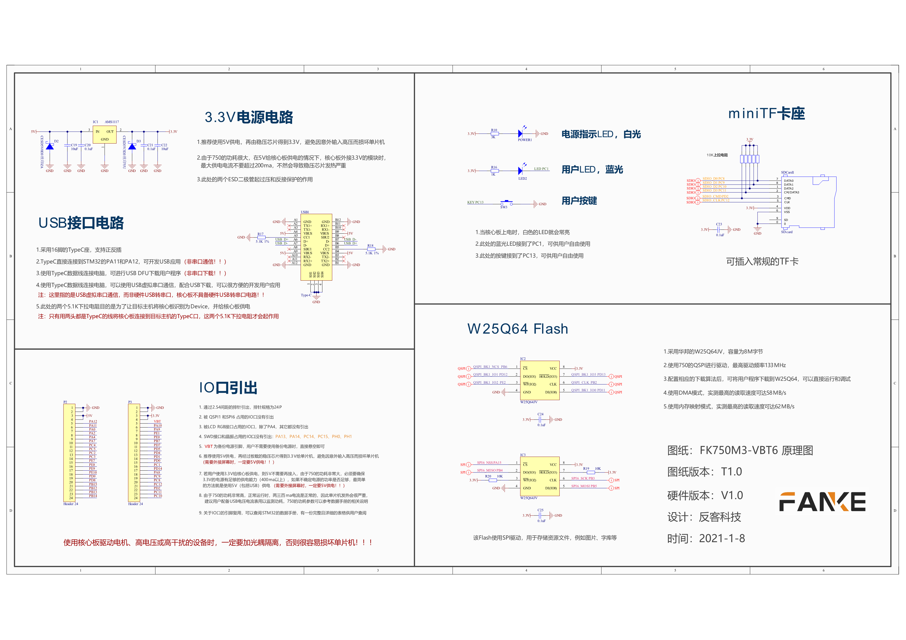

# STM32H750VBT6 bootloader

~~~ 
反客科技H7核心板
~~~

~~~
环境: win10 + CLion + openocd + stm32cubemx
~~~

## 原理图

~~~
参考反客科技提供的程序

反客科技淘宝店铺: https://shop212360197.taobao.com/?spm=a230r.1.0.0.204e2dc8LplcWh
~~~